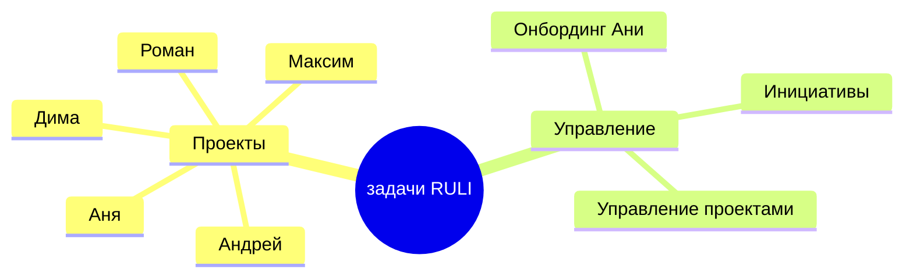
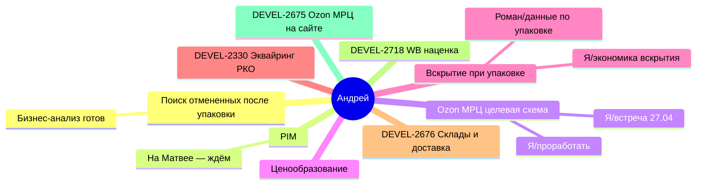
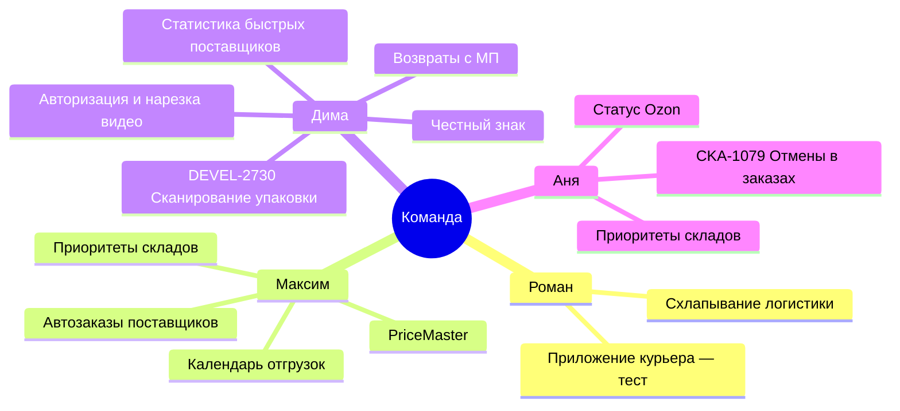
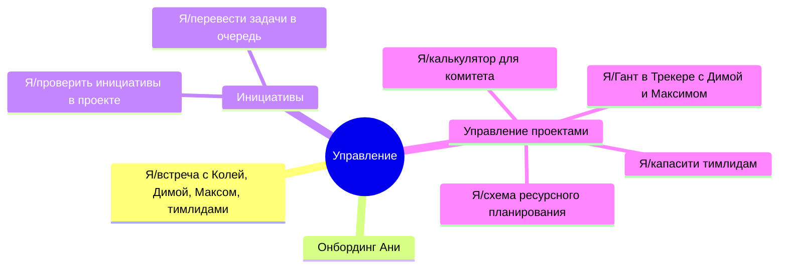

# Диалог: чтение MindManager (.xmmap / .mmap) и идея редактора

Файлы: `/home/fefelovandrey/Mindjet/TasksRULI_22062026.xmmap`, `/home/fefelovandrey/Mindjet/TasksRULI (1).mmap`

---

## 1. Можно ли прочитать `.xmmap`?

**Пользователь:** `/home/fefelovandrey/Mindjet/TasksRULI_22062026.xmmap` — ты сможешь такой формат прочитать?

**Ответ:** Да. Файл `.xmmap` — карта **MindManager** (версия 20.1). Это один большой **XML-документ** (~452 КБ). Текст узлов лежит в элементах `<ap:Text PlainText="...">`.

Прочитано: **79 узлов**, корень — **«задачи RULI»**.

**Что могу:**
1. Разобрать дерево — полная иерархия или нужная ветка
2. Извлечь списки — все DEVEL-*, все «Я/…», задачи по исполнителям
3. Конвертировать — в Markdown, таблицу, CSV
4. Сопоставить с Трекером — сверить DEVEL-номера с Yandex Tracker

**Ограничения:** визуальное оформление (иконки, цвета, связи) частично теряется; метаданные (дедлайны, прогресс) в Custom-полях нужно парсить отдельно.

---

## 2. Можно ли прочитать `.mmap`?

**Пользователь:** `/home/fefelovandrey/Mindjet/TasksRULI (1).mmap` — а в таком формате?

**Ответ:** Да. `.mmap` — **ZIP-архив** MindManager 20.1. Внутри: `Document.xml`, XSD-схемы, `Preview.png`.

| | `.xmmap` | `.mmap` |
|---|---|---|
| Содержимое | XML напрямую | ZIP → `Document.xml` |
| Размер | ~452 КБ | ~41 КБ |
| Узлов | 79 | 49 |

Оба файла — карта **«задачи RULI»**; `.mmap` старее (апрель 2026, 49 узлов), `.xmmap` свежее (июнь 2026, 79 узлов, больше DEVEL-задач и ветка «Управление проектами»).

---

## 3. Визуальное отображение без программы

**Пользователь:** а ты как-то можешь это визуально отобразить без программы?

**Ответ:** Да — через **Mermaid-диаграммы** прямо в чате (интерактивная схема, можно масштабировать).

### Общая структура



### Проекты → Андрей



### Проекты → Роман, Максим, Дима, Аня



### Управление



**Что получается / не переносится:**

| Могу здесь | Не переносится из `.mmap` |
|---|---|
| Дерево веток, иерархия | Точные цвета, иконки, формы узлов |
| Mermaid-схемы в чате | Свободное расположение «как нарисовал» |
| Текстовое дерево, Markdown, таблица | Кликабельные гиперссылки внутри узлов |

---

## 4. MindJet и идея своего редактора (размышления, без реализации)

**Пользователь:** найди описание программы MindJet. Ты сможешь сделать такой же интерфейс с редактированием? Пока ничего не делай — просто размышляй.

**Ответ:**

### Что такое MindJet / MindManager

**MindManager** (раньше **Mindjet**) — коммерческий редактор mind map и лёгкого управления проектами.

**Интерфейс:**
- главное окно карты (радиальная/древовидная схема);
- лента как в Office: Home, Insert, Design, Task, View;
- боковые панели: индекс, поиск, My Maps;
- режимы: карта, outline, Gantt, расписание, фильтры.

**Редактирование:** центральная тема + подтемы; горячие клавиши; drag-and-drop; форматирование; задачи с датами; вложения, ссылки; co-editing (Pro).

**Форматы:** `.mmap` (ZIP + Document.xml), `.xmmap` (XML напрямую).

### Смогу ли сделать «такой же»?

**Коротко:** полную копию MindManager — нет (месяцы работы). **Урезанный редактор ваших карт** — да.

#### Уровень 1 — «80% пользы для Tasks RULI» (реалистично)
- дерево узлов с текстом;
- добавление / переименование / удаление / перетаскивание;
- сворачивание веток;
- импорт/экспорт `.mmap` / `.xmmap` (PlainText + иерархия);
- парсинг «Я/», «Роман/», DEVEL-XXXX.

Библиотеки: Mind Elixir, jsMind, React Flow / Vue Flow, d3-hierarchy.

#### Уровень 2 — «похоже на MindManager» (сложно)
- радиальная раскладка, inline-редактирование, панель свойств, undo/redo;
- сохранение в MindManager XML (риск потери Custom-полей).

#### Уровень 3 — «как MindManager Pro» (нереалистично как pet-project)
- Gantt, SmartRules, co-editing, Jira/SharePoint, полный ribbon.

### Вывод
Для кейса RULI оптимально: **радиальная карта + outline-режим**, inline-редактирование, импорт/экспорт XML, опционально парсинг DEVEL и исполнителей.

---

## 5. ASCII-дерево (`TasksRULI_22062026.xmmap`)

**Пользователь:** отобрази в формате ASCII-дерево файл в первом сообщении.

```
задачи RULI
├── Проекты
│   ├── Андрей
│   │   ├── Поиск отмененных после упаковки
│   │   │   └── Бизнес-анализ готов
│   │   ├── PIM
│   │   │   └── На Матвее - ждем и ничего не делаем
│   │   ├── [ozon] Соблюдение МРЦ "целевая" схема
│   │   │   ├── Я/В свободное время прорабатывать
│   │   │   └── Я/Встреча с ребятами на 27.04 по целевой схеме
│   │   ├── Ценообразование
│   │   ├── Вскрытие при упаковке
│   │   │   ├── Роман/Скинуть данные по стоимости упаковки
│   │   │   └── Я/Посчитать данные по экономике вскрытия и экономической целесообразности
│   │   ├── DEVEL-2330 Эквайринг при заполнении рко, должен притягиваться заказ
│   │   │   └── Я/Посмотреть задачу  DEVEL-2330 или отдать Аней
│   │   ├── DEVEL-2676 Подумать над тем как избежать перепутывания складов к способу доставки
│   │   │   └── Я/Посмотреть задачу DEEVEL-2676 или отдать Ане
│   │   ├── DEVEL-2718 [wb] Новые правила наценки за позднюю отгрузку.
│   │   │   ├── Я/Провести анализ и подготовить требованния
│   │   │   ├── Передать требования команде разрабоотки
│   │   │   │   └── Я/Назначить встречу
│   │   │   ├── Заполнение данных в Календаре
│   │   │   └── Я/Обсудить с Максимом что я емуу передаю
│   │   └── DEVEL-2675 [ozon] МРЦ по цене покупателя на сайте
│   │       └── Я/Назначить встречу с Денисом и Сергеем и обстучать еще варианты
│   ├── Роман
│   │   ├── Схлапывание логистики
│   │   │   ├── Роман/Должен поставить встречу с Юлей по проектированию схлапывания логистики
│   │   │   └── Я/Посмотреть что скинул Сергей по расчету экономики схлапывания логистики
│   │   └── Приложение для курьера по возвратам
│   │       └── Роман/В тестировании
│   ├── Максим
│   │   ├── PriceMaster
│   │   ├── Автозаказы поставщиков 
│   │   │   ├── Я/Обработать результаты встречи по процессам вместе с автозаказом и сделать какое то резюме
│   │   │   └── Я/Провести аналитику по автозаказам, чтобы можно было брать в работу
│   │   ├── Календарь отгрузок 
│   │   │   └── Я/Сделать описание (взять abcp) плюс добавить туда праздничные дни
│   │   │       ├── ссылка на 
│   │   │       └── Я/Переговорить с Денисом и понять как сроки по ОЗОН считаются и должны считаться
│   │   └── Автоматизация приоритетов складов
│   │       ├── 15.04 на дейлике Python смотрим что с этой задачей- расходятся показания
│   │       └── Должен что то подумать Лоскутов
│   ├── Дима
│   │   ├── Возвраты с МП (кроме нарезки)
│   │   │   ├── Я/Провести ребятам вводную по требования (PBR)
│   │   │   └── Тестирование
│   │   │       └── Аня/Провести тестирование на проде
│   │   │           └── Аня/Контроль исправления замечаний
│   │   ├── Обработка статистики по быстрым поставщикам
│   │   │   ├── Я/С Ивановым обсудить про заполнение 999 
│   │   │   └── Я/Продумать что нужно для запуска
│   │   ├── Авторизация и нарезка видео
│   │   │   └── QR коды 
│   │   ├── DEVEL-2730 Необходимо после сканирования при упаковке в поле ввода удалять все пробелы и специальные символы, внутри и вконце ШК
│   │   │   └── Я/Отдать Диме анализ после отпуска
│   │   └── Честный знак
│   │       ├── Оценка трудозатрат Честный знак
│   │       ├── Аня/Проектирование логики УПД-ПТУ-Приход
│   │       ├── TrueAPI 
│   │       │   └── Я/Проработать вопрос с флешкой
│   │       └── Я/Коля Иванова и Иван Григоров просят поправить вехи по Честному знаку
│   └── Аня
│       ├── Корректный статус ОЗОН
│       ├── Приоритеты складов
│       └── CKA-1079 Анализ корректной работы по отменам в заказах поставщиков 
│           └── Аня/Разобраться что нужно делать
└── Управление
    ├── Я/Поставить с Колей, Дима, Макс и Тимлиды встречу чтобы обсудить управление разработчиками без PM и без митингов
    ├── Онбординг Ани
    ├── Инициативы
    │   ├── Я/Проверить инициативы, которые уже есть в проекте
    │   └── Я/Проверить и перевести заведенные задачи в очередь инициаттив
    └── Управление проектами
        ├── Я/Сформировать задание тимлидам сделать расчет по капасити (или отдать это Беспалову)
        ├── Я/Подгтовит калькулятор для планирования на комитете
        ├── Я/Сделать схему ресурсного планирования - зафиксировать о чем договорились
        └── Я/С Димой и Максимом обсудить на чем мы остановились по планированию Ганта - и попробовать это сделать сразу в Трекере
```

Всего узлов: **79**.

---

## 6. Уровень 1: визуальное добавление узлов или чат?

**Пользователь:** на уровне 1 можно будет добавлять в визуальной форме узлы? или это оставим на диалог с тобой в отдельном чате?

**Ответ:** **На уровне 1 — да, добавление узлов в визуальной форме возможно.** Это базовый минимум редактора.

### Что будет в UI (уровень 1)

| Действие | Как в интерфейсе |
|----------|------------------|
| Добавить дочерний узел | Кнопка «+» или Tab / Enter |
| Добавить соседний | Enter на том же уровне |
| Переименовать | Двойной клик → inline |
| Удалить | Delete / контекстное меню |
| Переместить | Drag-and-drop |
| Свернуть ветку | Клик по «−» |

### Что лучше оставить на чат с AI

- «Разбей DEVEL-2718 на 5 подзадач»
- «Перенеси все `Я/` в отдельную ветку»
- «Сверь с Tracker и добавь недостающие DEVEL»
- «Импортируй `.xmmap` и покажи diff»
- «Экспортируй в Markdown»

### Разделение

```
Визуальный редактор (уровень 1)     ↔     Чат с AI
• клик, drag, inline-текст                  • bulk-операции, Tracker
• сохранение в файл                         • генерация веток из текста
```

**Итог:** на уровне 1 узлы добавляются **визуально в приложении**. Чат — для сложных правок, не для каждого клика.

---

## 7. Что такое outline + простая схема?

**Пользователь:** что такое outline + простая схема?

**Ответ:**

### Outline (контур / список с отступами)

Иерархический список, как в Word или Notion:

```
▼ задачи RULI
  ▼ Проекты
    ▼ Андрей
      • PIM
        └ На Матвее — ждём
      • DEVEL-2330...
    ▼ Роман
  ▼ Управление
```

- Enter — новый узел рядом; Tab — вложить; ▼/▶ — свернуть; drag — переставить.
- **Плюсы:** быстро, длинные названия не обрезаются.
- **Минусы:** не «mind map на доске».

### Простая схема

Упрощённая визуальная карта — прямоугольники и линии, без изогнутых веток MindManager:

```
                    ┌─────────┐
                    │ задачи  │
                    │  RULI   │
                    └────┬────┘
           ┌─────────────┼─────────────┐
           ▼             ▼             ▼
      ┌─────────┐  ┌─────────┐
      │ Проекты │  │Управл.  │
      └────┬────┘  └─────────┘
           ▼
      ┌───────┐
      │Андрей │
      └───┬───┘
          ▼
       ┌─────┐
       │ PIM │
       └─────┘
```

- **Плюсы:** обзор структуры.
- **Минусы:** длинные тексты не помещаются; много узлов — тесно.

### Вместе — два вида, одни данные

| Вкладка | Для чего |
|---------|----------|
| **Outline** | править: добавлять, переименовывать, переставлять |
| **Схема** | смотреть структуру, презентовать |

### Сравнение с MindManager

| | MindManager | Outline + простая схема |
|---|---|---|
| Вид | Радиальная карта | Список + блоки |
| Редактирование | На узлах на карте | В основном в outline |
| Срок разработки | Долго | Быстрее |
| 79 узлов | Хорошо | Outline — отлично; схема — обзор |

**Коротко:** outline — дерево-список для работы; простая схема — картинка для обзора. Обычно начинают с **outline**, схему добавляют вторым шагом.

---

## 8. Сохранение диалога

**Пользователь:** сохрани весь диалог в корень папки в файл `dialog.md`. По файлу ничего в структуру добавлять не надо.

**Ответ:** файл создан: `dialog.md` в корне workspace RULI.
